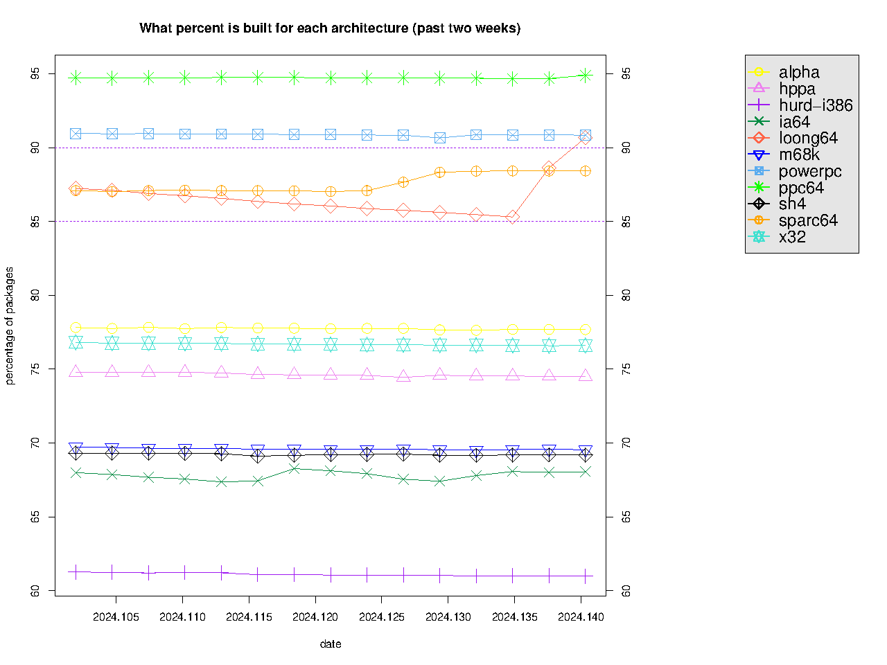

每周一都为大家报道 LoongArch 社区最前线的第一手新鲜资讯！
上周的进展主要有 Linux、工具链和发行版。
详情点进来看！

<!-- truncate -->

如无特别说明，文中提及的日期、时间都为北京时间（UTC+8）。

本期周报的实际发稿时间是周二晚间，因为周一都在忙别的。

## 先「马」再看 {#marked-projects}

本栏目的内容具有一定延续性，将持续追踪报道 LoongArch 领域的重要或长期项目（坑）。

### Linux {#linux}

在移植、测试 Chromium 的过程中，社区同学们发现了 Chromium seccomp 沙箱机制对
`statx` 系统调用的处理方式存疑。[xen0n] [重新发起了](https://lore.kernel.org/loongarch/20240226-granit-seilschaft-eccc2433014d@brauner/T/#t)讨论：
本次的问题本质上与数年前就已为社区所深知的 seccomp 深参数审查（deep argument inspection）问题相同。
截至周一晚间，已经累积了相当多的讨论内容，其深度、复杂度甚至不日即可撑起一篇专栏文章；
我们将在尘埃落定之后为您追踪报道。

[xen0n]: https://github.com/xen0n

来自统信的 Wang Yuli [意图清理](https://lore.kernel.org/loongarch/20240226080328.334021-1-wangyuli@uniontech.com/)
LoongArch CRC32 加速代码中的两条 64 位模式用不着的语句。xen0n 建议 :ta:
可以不用删掉：换成 `#ifdef` 的话，万一未来增加 LoongArch32 支持，不用再改一次代码。

近日，Linux 项目[成为了](https://lwn.net/Articles/961961/)自己的 CVE 编号权威机构（CVE numbering authority, CNA）。
这意味着 Linux 可以自己给自己的安全漏洞分配 CVE 编号了。
于是乎，先前 LoongArch 的 BPF 实现中[被发现并修补的](https://lore.kernel.org/loongarch/20231222141546.50866-1-hengqi.chen@gmail.com/)一处内存越界访问，
便[成为了](https://lore.kernel.org/linux-cve-announce/2024022256-CVE-2024-26588-d6d5@gregkh/)新时期的首个
Linux/LoongArch CVE：CVE-2024-26588。
我们摘录并翻译此漏洞的影响范围如下：

* 从 6.1 起，被提交 `bbfddb904df6f82` 引入，在 6.1.75 为提交 `4631c2dd69d9` 所修复
* 从 6.1 起，被提交 `bbfddb904df6f82` 引入，在 6.6.14 为提交 `9aeb09f4d85a` 所修复
* 从 6.1 起，被提交 `bbfddb904df6f82` 引入，在 6.7.2 为提交 `7924ade13a49` 所修复
* 从 6.1 起，被提交 `bbfddb904df6f82` 引入，在 6.8-rc1 为提交 `36a87385e31c` 所修复

请使用上游内核的 LoongArch 用户、开发者注意。（xen0n 为您检查了 Loongnix 的 Linux 4.19.190.8.14 代码，不存在该问题。但不确定其他旧世界系统或「产品内核」是否受影响。）
感谢 [xry111] 提供新闻线索！

[xry111]: https://github.com/xry111

:::info 请受中国法律管辖的读者注意
这是友情提醒：如果您或您的组织在中国大陆法域内提供、运营网络服务或从事信息安全工作，
那么您应该已经对[国家信息安全漏洞共享平台](https://www.cnvd.org.cn)（CNVD）
与[《网络产品安全漏洞管理规定》](https://www.gov.cn/gongbao/content/2021/content_5641351.htm)有所了解。
简单来说，您在中国处理安全漏洞时，如果您是「网络产品提供者」，您需要在 2 日内上报 CNVD 等国内漏洞共享平台；
如果您是信息安全工作者，对漏洞细节等信息的发布也受到一些具体限制。
违反《规定》导致危害网络安全等后果的，还将触发[《网络安全法》罚则](https://www.cac.gov.cn/2016-11/07/c_1119867116_3.htm)。

由于 LoongArch 尚处于新旧世界交替的过渡期，本例漏洞所影响的内核版本可认为实际没有部署：
实际承载业务的 LoongArch 装机量仍以旧世界为主，而新世界用户群体的「追新」则相当激进，且新世界用户以开发者为主，不承载重点业务。
因此即便本例漏洞未被首先上报 CNVD（笔者未查证），事后看来，也没有对任何法益造成实质减损，因而不至触发《规定》乃至《网络安全法》的罚则。

即使如此，笔者认为仍有必要给读者朋友们提个醒：假如之后再给 Linux 等开源软件「捉虫」，觉得像是有安全影响的话，请认真评估下！
:::

### 工具链 {#toolchain}

#### binutils {#binutils}

Fan Peng（编者注：姓在前）[移除了](https://sourceware.org/pipermail/binutils/2024-February/132664.html)链接可执行文件时一处多余的未解析符号检测。
看补丁的说明文字，似乎是修复了某些软件链接失败的问题。

mengqinggang [修复了](https://sourceware.org/pipermail/binutils/2024-February/132663.html)三种重定位类型的定义错误。

#### GCC {#gcc}

为防止先前的 GCC 12.x/13.x 版本与 Binutils 2.42 搭配时[生成错误代码](https://github.com/loongson-community/discussions/issues/41)，
不得不将 relaxation 支持往回移植到 GCC 12.4 与 GCC 13.3。

对 GCC 12 而言，唯一可感知的明显变化是新增了 `-mrelax` 与 `-mno-relax` 支持；
当 `-mpass-relax-to-as` 生效时，它们将被透传至汇编器。`-mpass-relax-to-as`
的默认取值取决于 GCC 构建时搭配的汇编器是否支持 `-mrelax`。GCC 本身的行为则不受这些开关影响。

对 GCC 13 而言，情况也类似：如果在 GCC 构建时检测到汇编器支持 `-mrelax`，
并且在当次具体的 GCC 调用时也生效了 `-mrelax`，那么将默认开启 `-mno-explicit-relocs`。
后一条要件是 [Xi Ruoyao][xry111] 为了保持与 Binutils 2.41
搭配时的行为不变而特意[做的兼容](https://gcc.gnu.org/pipermail/gcc-patches/2024-February/646269.html)。

[Xi Ruoyao][xry111] 还[去除了](https://gcc.gnu.org/pipermail/gcc-patches/2024-February/646487.html)
CRC intrinsic 被翻译为指令后多余的符号扩展操作。
由于 CRC 操作几乎总是出现在热点循环中，此优化势必提升性能。

感谢 [Xi Ruoyao][xry111] 提供本节的新闻线索！

#### LLVM {#llvm}

[xen0n] 在研究 Telegram Desktop 为何会在 Scudo 的 `free` 函数中无限递归的过程中，
顺便发现 Scudo 没有用上 LoongArch 的专门 CRC 计算指令，
遂顺手[做掉了](https://github.com/llvm/llvm-project/pull/83113)。

[heiher] [改进了](https://github.com/llvm/llvm-project/pull/82767) LoongArch
代码生成后端对「长得像加法」操作的判断方式，从而能够避免生成少量不必要的指令。

[heiher] 还把 LoongArch 的 `addrspacecast` 都[标记为了](https://github.com/llvm/llvm-project/pull/82332)空操作。
这[修复了](https://github.com/llvm/llvm-project/issues/82330)在 Alpine Linux
上旧版本 Rust（1.72.0）构建失败的问题。
值得注意的是：此 issue 中提到的两个软件 Alpine Linux 和 Rust 1.72.0 实际上都没有
LoongArch 支持——后者更是一个已发布版本，我们无法坐时光机为其添加支持。
考虑到 musl 的 LoongArch 支持刚刚进入主线，而 musl 是 Alpine Linux 的 libc，
因此这应该代表着 Alpine Linux 的适配工作在龙芯内部得以继续开展了。

[heiher]: https://github.com/heiher

## 杂闻播报 {#assorted-news}

龙芯中科[发布了](https://mp.weixin.qq.com/s/T-91LzHC1aZYrQPVyWoaSw)基于龙架构讲授的计算机核心课程
MOOC（慕课）资源。

时过境迁，Debian `loong64` 移植的完成度于 2 月 22 日前后再次超过 90%，预计之后不容易跌破了。
（先前虽然也达到过 90% 甚至更高，但当时许多基础包是手工上传的，因此每当这些基础包版本更新，完成度就会跌。
目前此情况已得到相当缓解。）
感谢 [RevySR] 提供以上两条新闻线索！

[安同开源社区][aosc]（AOSC）贡献者[白铭骢][MingcongBai] 给 KDE 桌面硬件抽象组件
Solid [增加了](https://invent.kde.org/frameworks/solid/-/merge_requests/159)
LoongArch `/proc/cpuinfo` 的解析支持，以便在 KInfoCenter 正确显示龙架构处理器的型号。
感谢 :ta: 自己制造并提供新闻线索！

2 月 16 日，musl libc 上游[合并了](https://git.musl-libc.org/cgit/musl/commit/?id=522bd54edaa2fa404fd428f8ad0bcb0f0bec5639)龙架构移植。
待 musl 新版本正式发布后，Rust musl target、Gentoo musl profile、Alpine Linux
等等大量工作都将可以开展了。
感谢 [heiher] 提供新闻线索！

[Xi Ruoyao][xry111] 给 `elf.h` [增加了](https://sourceware.org/pipermail/libc-alpha/2024-February/154909.html)编号从
110 到 126 的新 LoongArch 重定位类型定义。
之后对 elfutils [也做了](https://sourceware.org/pipermail/elfutils-devel/2024q1/006839.html)类似的事情。

[Xi Ruoyao][xry111] 还给 XZ 项目[增加了](https://github.com/tukaani-project/xz/pull/86) LoongArch CRC32 优化。
感谢 [Xi Ruoyao][xry111] 提供以上两条新闻线索！

[aosc]: https://aosc.io
[MingcongBai]: https://github.com/MingcongBai
[RevySR]: https://github.com/RevySR

## 张贴栏 {#bulletin}

本栏目可供张贴公益性质的各种信息。

* [xen0n] [发出了](https://github.com/loongson-community/discussions/issues/45)英雄帖：为 BLAKE3 添加 LoongArch SIMD 优化。
* 您可在 GitHub [浏览](https://github.com/loongson-community/discussions/labels/%E8%8B%B1%E9%9B%84%E5%B8%96)目前所有开放的英雄帖。
* 本周报[持续接受网友投稿][call-for-submissions]。欢迎来上游坐坐！

[call-for-submissions]: https://github.com/loongson-community/areweloongyet/issues/16
