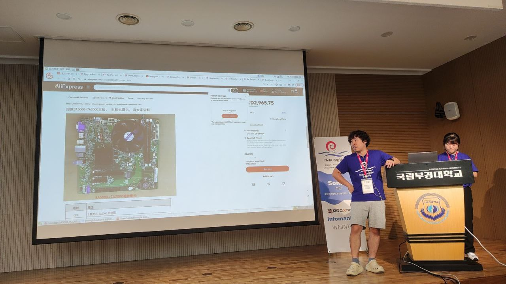
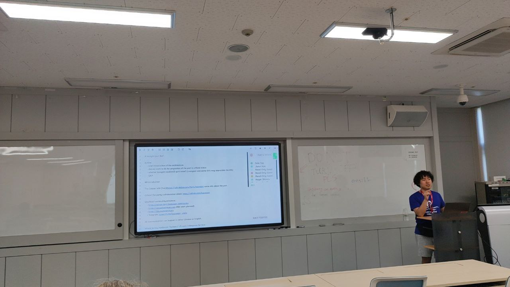

号外：2024 年 7 月 27 日至 8 月 3 日，Debian 社区的年度盛会
DebConf 24 在韩国釜山国立釜庆大学大渊校区成功举办了。本期特刊将带您回顾
DebConf 24 期间发生的与 LoongArch 生态相关的新闻动态。

<!-- truncate -->

如无特别说明，文中提及的与会议日程相关的日期、时间都为 DebConf 24 举办地釜山的当地时间（UTC+9）。

## 概况

按照 DebConf 24 闭幕式幻灯片的统计数字，共有 339 位与会者实际参会，其中
19 位来自中国大陆。您可在
[DebConf 官网的统计数字页面][debconf-stats]查阅更多详细信息。

[debconf-stats]: https://debconf24.debconf.org/register/statistics/

LoongArch 的相关人士中，笔者以 Gentoo 开发者、LoongArch 生态的第三方利益无关贡献者、Debian
loong64 port 的协助者身份参加了 DebConf 正式议程。龙芯公司推进 Debian loong64
移植的成员之一张丹丹也参加了会议。

## 议程

7 月 30 日 10:30，张丹丹在釜庆大学未来馆 2 楼 Somin 大堂[^somin]（소민홀）[分享了](https://debconf24.debconf.org/talks/159-expression-of-thanks-and-brief-introduction-the-status-of-loong64-port/)
Debian `loong64` 移植的现状，并向社区力量表达了感谢。现场有各国观众十数人。这场分享也是张丹丹同学在国际技术会议讲台的首秀；在双方的提前安排下，xen0n
协助了串场，以及提供了问答环节的口译支持。听众以热烈的掌声回馈了她的分享。

[^somin]: 「소민」大概率是人名，但笔者并未能检索到对应的真实人物及其对应的汉字写法。

:::tip 花絮：本场次的讲者设备
该分享是从张丹丹的自用 3A5000 笔记本的 HDMI 输出投影的。用到的软件是经典的
Loongnix MATE 桌面环境与 WPS Office。xen0n 当时应该是花了几秒钟习惯了一下不用先装
libLoL 即可使用 WPS 这个冲击性事实，毕竟这家伙在新世界住太久了……
:::

在该分享的问答环节，台下听众对海外购买龙架构硬件的渠道十分感兴趣，一定要让
xen0n 出示至少一个购买页面。xen0n 遂展示了 AliExpress 上的一种 3A6000
开发板商品，提请群众小心个别型号主板的主线内核支持状况，并借机推介了未来将上市的、更高性能的 3B6600、3C6000 等新型号。

8 月 1 日 17:00，xen0n 在釜庆大学未来馆 2 楼「CEO」教室[主持了](https://salsa.debian.org/debconf-team/public/data/dc24/-/blob/main/etherpad/txt/161-loong64-port-bof.txt)关于
`loong64` 移植的[专题讨论](https://debconf24.debconf.org/talks/161-loong64-port-bof/)（Birds-of-a-Feather，BoF）。现场也有各国观众十数人。xen0n
介绍了 LoongArch 的前世今生，解答了一系列典型问题，介绍了社区对该移植的转正工作的后续规划。问答环节广泛涉及了内核开发、某具体包的打包细节、硬件性能对比、笔记本的续航、架构兼容性等话题；xen0n 与台下的张丹丹以及其他热心中国听众一道，详细解答了这些问题。

:::tip 花絮：本场次的讲者设备
该讨论也是用张丹丹的自用 3A5000 笔记本投影的。用龙芯浏览器的无痕模式登录了
xen0n 的 Salsa 账号，以便有权限现场编辑 Etherpad，记录讨论内容。

xen0n 多年来一直以为自己笔记本有 HDMI 输出——其实只有 Type-C，不止被坑过一次，本次也不例外：直到开始前
10 分钟才发现这个问题，所以只好临时借用了，还好只需打开网页即可 :new_moon_with_face:。
:::

:::info
两场活动均没有官方直播或录像，我们也并未注意或收集在场人员的信息。这是有意为之：考虑到龙芯中科自
2023 年 3 月以来便[处于](https://www.federalregister.gov/d/2023-04558/p-15)美国商务部《出口管理条例》实体清单（EAR
Entity List）中这一事实，不能排除有些外部力量会向那些被确认参与了龙芯相关议程的友善个体施加风险。出于底线思维，我们需要保护这些善良的人。
:::

## 花絮：现场的 LoongArch 设备们

在 DebConf 会场我们总共展示了 2 台 LoongArch 设备：

* 3A5000M + 7A2000 笔记本：此设备直接来自龙芯北京总部的研发部门。
* 2K2000 盒子：此设备就是 2023 年 11 月 28 日在北京的 3A6000 发布会上首发的众多设备之一。

目前它们都已平安回到相应管理者的手中，不过它们的系统都变成了 Debian sid，时区也成了
`Asia/Seoul`。

:::tip 花絮的花絮
本次 DebConf 期间，也有一台釜庆大学的 Windows PC
在早先一场动手安装 Debian 的互动环节中，被重装成了 Debian 系统。闭幕式上这一事实被披露时全场爆笑并响起了掌声。
:::

由于 xen0n 的错觉——总以为肯定已经拍过照了，而实际都在紧张折腾装系统——而没有留存它们在现场的靓照，有些许遗憾；但考虑到两台设备都不是应季的新鲜产品，其实也还好。至少笔记本上的固定资产贴纸给围观群众脸上带去了许多微笑 :smirk_cat:。

本次的设备展示，准备得十分匆忙——xen0n 以为龙芯既然派了人，肯定会带硬件，便一直没过问。直到行前两天在群里十分放松地确认情况，才发现这事情完全不存在的！只好紧急招呼张丹丹：抓紧搞点能带的带上。而
xen0n 本人方便塞进旅行箱的只有一台辗转来到自己案头的
2K2000 盒子；它出厂预装的显然是 Loongnix 和远古测试版固件。这导致了
xen0n 接下来在会场休息区几乎所有的闲暇都在与[坏人](https://github.com/shankerwangmiao)一道，与这玩意的固件作斗争：虽然要到了一份近期的固件更新，但即便关掉「传统启动模式」也带不起主线内核。

更要命的是，此盒子的串口引出形式非标准：是
RS-232 电平，却没附带 RS-232 接口，需要杜邦线引出——而市面上杜邦线接头的 USB 串口线都是 TTL 电平的。于是为了调试，坏人只好做了一些拿手的坏事 :sunglasses:：

1. 手搓了一套 earlyprintk 机制：将日志信息写入一块保留的物理内存区域，并让内核 panic 之后自动重启；
2. 重启进入盒子上预装的 Loongnix 系统，但额外指定内核参数，使其也保留相同的物理内存区域；
3. 读取该区域的内容，并祈祷这期间固件、引导器、内核都没有将其覆盖掉——「哪个固件没事干去清零内存啊」。

:::info 为啥第二步非得用 Loongnix？
为了精确指定一段物理内存不给内核用，要用的参数 `memmap` 在主线上仅受 x86、MIPS 和 Xtensa 三种架构支持。聪明的您大概不需要更多解释了……
:::

祈祷发挥了作用：最终，在敲除了固件 ACPI DSDT 表的 LPC IO 区域之后，终于成功引导进
Gentoo 的 LiveUSB 了。——你没看错：xen0n 由于掌握技能有限，以及 debian-installer 尚未完全适配的缘故，只好用之前手搓的
Gentoo LiveUSB 去 `debootstrap` Debian。

最终，好歹在 `loong64` port BoF 开始之际，群众得以在 xen0n 笔记本的全屏 `ffplay`
界面上，透过 xen0n 从家里带来原本直播用的采集卡，一睹 2K2000 盒子集显的 HDMI
输出芳容了。当然，xen0n 忘记了对现场 2 台笔记本 1 个盒子和一堆连接线的盛况拍照留念 :new_moon_with_face:。

桌上情况示意图

```mermaid
flowchart BT
    Mains[教室第二排某席位的欧标插座]
    SomeSacrificedDevice[被拔掉的某教学设备<br />（后续已恢复）]
    ExtendedAdapter[xen0n 带的公牛延长插座]
    Xen0nLaptop[xen0n 的 x86 笔记本]
    Ls3a5000Laptop[3A5000M 笔记本]
    Ls2k2000Box[2K2000 盒子]
    HDMICaptureCard[xen0n 带的 USB HDMI 采集卡]

    Mains -.- SomeSacrificedDevice
    Mains ---|Revy 送 xen0n 的转换头| ExtendedAdapter
    ExtendedAdapter ---|电源适配器| Xen0nLaptop
    ExtendedAdapter ---|xen0n 的 Type-C 充电头和 1.8m 手机数据线| Ls3a5000Laptop
    ExtendedAdapter ---|电源适配器| Ls2k2000Box

    Xen0nLaptop ---|采集卡附送的短 USB 线| HDMICaptureCard ---|xen0n 带的长 HDMI 线| Ls2k2000Box
    Ls3a5000Laptop ---|坏人带的以太网线| Ls2k2000Box
```

:::tip 花絮的花絮 2
至于因为这个 LiveUSB 上的工具链和包管理器被卸掉了（毕竟它其实就是
LiveCD ISO 被 `dd` 到了 U 盘而已，LiveCD 的容量控制还是必要的），以至于 xen0n 不得不先完整安装一遍
Gentoo 而枯等了大几小时，回过头看，也能够接受了……——毕竟否则就没法编译 `debootstrap`，也就没得装 Debian。

（等到装完了，才发现其实在解压 Gentoo stage3 之后，只需要给它装上
`debootstrap` 就足够了。因为完全可以进行一个 `chroot` 的套娃：在
Gentoo chroot 里边再挂上 Debian 分区，就可以直接 `debootstrap` 了。甚至都不用单独分区……而
xen0n 这个大怨种甚至考虑到 LiveUSB 上的现成内核没支持手头的 USB 无线网卡，把内核都编完了。）
:::

:::tip 花絮的花絮 3
在 7 月 30 日坏人花了一下午搓出 earlyprintk 之后，当晚 xen0n 回到酒店，发现 Linux
v6.11-rc1 发布了，LWN [报道了](https://lwn.net/Articles/982605/)后半程合并窗口；一个叫作
`reserve_mem` 的内核参数赫然在列，意在与同期新增的 `ramoops.mem_name` 参数配合使用。它的作用？当然是在内核
oops 的时候往保留的内存记录信息。Oops……

xen0n 将此消息告知了坏人，坏人云：「有意思！」
:::

:::info 盒子固件问题的结论
从 DebConf 归来后，坏人最终查清了 2K2000 盒子固件 ACPI DSDT 数据的问题：它声明的
IO 空间没有对齐到页大小。这让一个映射内存区域的循环跑飞了。

坏人已经[提交了](https://lore.kernel.org/all/20240814-check_pci_probe_res-v3-1-b6eaa6f99032@gmail.com/)内核补丁。目前该问题已经牵扯了
PCI、内存管理（mm）两个子系统，可能比我们预期的更棘手；不过好歹是查明了。坏人威武 :sunglasses:
:::

## 笔者随想

Debian 是 Linux 发行版生态中，最为重要的社区力量之一。由于其软件版本与 ABI
演进稳定、部署简便、熟练用户与打包者众，Debian 与其衍生发行版 Ubuntu
于是成为了国内外大量软件企业为 Linux 开发时所采用的事实运行环境标准与版本基线。而
LoongArch 作为基础软件领域的后来者，生态参与者们对稳定基线的需求，则使得人们与
Debian 一拍即合：事实上，即便您不使用或开发 Debian，但只要您关心您或者他人的软件在整个
LoongArch 生态的兼容性、互操作性——不论开源与否，那么参与 Debian 工作很可能就是个明智选择。

DebConf 是全球诸多开源盛会之一。与会者熙熙攘攘，从地球的各个角落聚集到一地；既可以与背景相似的朋友唠嗑，也可以与地球另一侧的网友当面碰撞思想。实际上人类语言普遍会在转换为文字的过程中丢失大量信息，而无论传统上被认为「高语境」与否。这意味着任何语言都没有比「面聊」更有效的沟通形式了：大家实际上都高度依赖语气、神态与动作进行交流，也只有这样的第一手经验可以让人确证很多道听途说印象的真伪。笔者在会场与各国开发者相谈甚欢：与日韩开发者用汉字顺畅沟通和畅聊东亚工作文化（会心一笑）；意外发现初识计算机的童年经历与一位捷克开发者出奇地相似；在号称「半岛最先迎接日出」的艮絶串（간절곶）海角与新任
Debian 项目领导人等人一同畅想中国开发者的更深入参与；甚至在下榻酒店[^hotel]与友善的老板娘聊她的女儿、服装设计、上海与釜山——笔者在其中感受到了真心实意，并且相信朋友们也能用各自的经历印证。毕竟，如果如此多的个体都向你展露相似一面，而这些人们的背景与故事又如此多样，那么便很难相信这一切是出自主观编排，而非客观相似。

[^hotel]: 本届 DebConf 的官方住宿地点是釜庆大学的学生宿舍。由于存在宵禁，可能影响行动，因此笔者并未选择官方住宿。

——事实证明，在广大的自由/开源软件（FLOSS）社区当中，存在相当比例的群众，能够发现
LoongArch 及其生态能为人类带来的独特价值；这其中又有一部分同志，愿意付出时间甚至金钱，参与进这个崭新生态的建设当中。甚至，在信息产业之外的国际社会，我们也能重复确认朴素的良善与国际主义思潮，这些种子从未失去，而只是在等待土壤。作为这进程的亲历者，我们肩负着互通有无、培养信任、建设统一战线的责任：现阶段能做的不过是「团结一切可以团结的力量」。一旦我们做到了，很多美好的事情都将自动生长。

这当然对我们的工作提出了新的需求：可能需要将国际化（i18n）提上议事日程了，至少是向英文互联网单向的信息输出。这固然意味着更多的工作量，但或许也是对我们持续迭代协作流程、进一步提升工作效率，乃至招徕更多贡献力量的鞭策。

写在最后，在归国后，笔者也不禁想：在中国大地上，何时何地我们可以有属于
LoongArch 社区的技术盛会？也许不需要一上来就集齐七大洲[^antarctica]的贡献者，不需要有
3 天乃至一周的满满日程，不需要有丰盛的茶歇与奢华的晚宴；而是在某个城市或者乡村，朋友们在晚风中平常的聚会，只是话题从家长里短变成了打包和
ABI。又或者，LoongArch 电脑的同城用户们可以找一天网友见面，分享彼此
Powered by LoongArch 的生活点滴——LoongArch 甫一降生便遇上了疫情，现在该带它体验新中国的线下生活了！

[^antarctica]: 在「七大洲」的目标之中，最具挑战的部分大抵是南极洲——有没有同学愿意把龙架构设备带去南极科考站的？毕竟成熟工艺节点发热相对较大这一特点，在这边可能反倒是个优势……

## P.S.: 关于专栏长时间断更的说明

如您所见，这是《每周一龙》专栏 2 个月以来的第一次更新。您可能也在
Telegram 龙芯用户组看到了由于「实名手机号码欠费销户」而建议取关「咱龙了么」Bilibili、知乎、微信公众号的消息。作为网站维护者鸽子本鸽，有以下几点需要与大家说明：

* 本次长时间断更的主要原因是原定第 52 期周报的信息收集周期内，同时发生了「AMDGPU 与龙芯桥片的卧龙凤雏互动」与「`fstat` 问题尘埃落定」两件大事，这不巧与笔者的工作需求旺季重合了。后续笔者的大量时间消耗在差旅图中，也对追赶进度并无帮助。
* 周报仍将继续更新，但关于时间点，目前只能承诺「9 月 1 号之前」。
* 本期更新是一次对专栏形式的探索：后续将以单独的文章报道生态大事件，这将有助于保证专栏定期部分的时效性。
* 《咱龙了吗？》信息的唯一官方权威渠道是其 [GitHub 上游仓库](https://github.com/loongson-community/areweloongyet)与[官方网站](https://areweloongyet.com)，仍在持续维护。
* 后续，主创团队将考虑在国内社交媒体、平台建设官方的传播矩阵，而非仰赖第三方的自愿工作。当然这会挤占更多工作时间，因此请不要指望这一定会发生；如果您有意愿协助，请在 [GitHub 工单界面](https://github.com/loongson-community/areweloongyet/issues)与我们建立联系。
